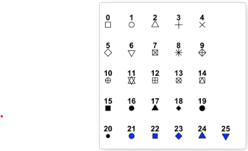

### Why R?

-   Open source programming language

-   Availability of wide range of packages - Powerful

-   Interactive plots (RShiny)

-   Highly customizable data visualization

-   Machine learning (ML) operations

### R vs RStudio

-   R is a programming language, whereas RStudio is an Integrated Development Environment (IDE)

-   RStudio provides the user interface for effective use of R

### Assumptions

Students have taken my previous class on:

-   Introduction to R

-   RStudio

-   Installing packages

-   Syntax (especially ggplot2 package)

-   Use of R Notebooks

### Helpful Resources

The following Github repository contains the code used for this class, the data, as well as documents containing instructions on installation of R and RStudio:

xyz.com

### Importing Data

Getting the required resources (loading libraries)

```{r}
library(tidyverse)
```

Reading data and saving as a data frame

```{r}
cropdata <- read.csv('fao_data_crops_data.csv')
```

#### Data Exploration and Cleaning

Getting column names

```{r}
colnames(cropdata)
```

Getting unique values and assigning it to a dataframe

```{r}
distinct(cropdata, country_or_area)
regions <- distinct(cropdata, country_or_area)
```

Another method using pipes - chains multiple operations

```{r}
cropdata %>%
  distinct(country_or_area) -> regions2
```

Getting number of unique or distinct values for a specific variable

```{r}
n_distinct(cropdata['country_or_area'])
n_distinct(cropdata$country_or_area)
```

Getting number of unique values for each variable / column using 'for loop'

```{r}
for (i in colnames(cropdata)) {
  print(paste('number of unique values for variable ', i,  ' are: ', n_distinct(cropdata[i]), sep = ''))
}
```

Exploring unique values for years

```{r}
cropdata %>%
  distinct(year)
```

Exploring unique values for parameters

```{r}
cropdata %>%
  distinct(element)
```

Different parameters must have different units, let us see

```{r}
cropdata %>%
  distinct(unit)
```

Which parameters have which units (distinct combination of specified parameters)

```{r}
cropdata %>%
  distinct(element, unit)
```

We can combine the 2 columns: element and the unit

```{r}
cropdata %>%
  mutate(parameter = paste(element, '_', unit, sep = ''), element = NULL, unit = NULL) -> cropdata2 
  # mutate is used to create, delete, or modify columns
```

I want to extract data from this global data-set, that satisfies the following condition:

-   Countries: Canada, USA, India, Russia, UK, France, Mexico, Portugal, Germany

-   years: 1991 - 2000

-   only area and production as parameters

We will use "filter" function for this

```{r}
countries <- c('Canada', 'India', 'Russian Federation', 'Germany', 'Portugal', 'Mexico', 'United Kingdom', 'United States of America', 'France')

req_years <- 1991:2000

req_parameters <- c('Area Harvested_Ha', 'Production Quantity_tonnes')

cropdata2 %>%
  filter(country_or_area %in% countries &
           year %in% req_years &
           parameter %in% req_parameters) -> cropdata3
```

The parameters are in the long form (melted form), let us convert the data frame into wide form (spread form)

we need two columns for this:

-   one variable who's levels will form the new columns (parameter)

-   one variable that will provide the value to these new variable (value)

```{r}
cropdata3 %>%
  spread(parameter, value) -> cropdata4
```

Let us calculate yield (tonnes/ha)

```{r}
cropdata4 %>%
  mutate(yield = (`Production Quantity_tonnes`/`Area Harvested_Ha`)) -> cropdata5
```

There are some rows containing 'NA' values

for the sake of today's exercise, let us delete those

```{r}
# checking NA values
sum(is.na(cropdata5$yield))

# easier way
summary(cropdata5)

# deleting rows with NA values
cropdata6 <- drop_na(cropdata5)

summary(cropdata6)

# removing rows with area = 0
cropdata6 %>%
  filter(`Area Harvested_Ha` != 0) -> cropdata7

summary(cropdata7)
```

### Data Visualization

Now let us plot some figures

Histogram

```{r}
cropdata7 %>%
  ggplot(aes(x=yield)) +
  geom_histogram()
```

Histogram with user-defined bins

```{r}
cropdata7 %>%
  ggplot(aes(x=yield)) +
  geom_histogram(bins = 100)
```

Other method to visualize distribution - Boxplots

```{r}
cropdata7 %>%
  ggplot(aes(x=yield)) +
  geom_boxplot()
```

There is a lot of variation as all the crops are included

Taking one crop as an example

```{r}
# use frequency table to make a selection
table(cropdata7$category)

# visualizing the frequency plot
cropdata7 %>%
  ggplot(aes(x=category)) +
  geom_bar(stat = 'count')
```

Let us go with 'grapes' and see the distribution of yield

```{r}
cropdata7 %>%
  filter(category == 'grapes') %>%
  ggplot(aes(x = yield)) +
  geom_boxplot()
```

Let us improve the visualization a bit

Viewing results for different countries

```{r}
# saving the figure to an R object
cropdata7 %>%
  filter(category == 'grapes') %>%
  ggplot(aes(x = country_or_area, y = yield)) +
  geom_boxplot() -> temp_plot

# viewing
temp_plot
```

How can we fix the labels?

Fixing axis labels

```{r}
# rotating the text
temp_plot + theme(axis.text.x = element_text(angle = 90))
```

Further fixing the labels

```{r}
# horizontal and vertical adjustment of the text
temp_plot + theme(axis.text.x = element_text(angle = 90, hjust = 1, vjust = 0.3))
```

Reordering by increasing values - reorder function

```{r}
cropdata7 %>%
  filter(category == 'grapes') %>%
  ggplot(aes(x = reorder(country_or_area, yield), y = yield)) +
  geom_boxplot() +
  theme(axis.text.x = element_text(angle = 90, hjust = 1, vjust = 0.3))
```

Reordering with decreasing value (highest first)

```{r}
# use a negative sign
cropdata7 %>%
  filter(category == 'grapes') %>%
  ggplot(aes(x = reorder(country_or_area, -yield), y = yield)) +
  geom_boxplot() +
  theme(axis.text.x = element_text(angle = 90, hjust = 1, vjust = 0.3)) -> temp_plot

#viewing
temp_plot
```

Adding labels

```{r}
# using ggtitle, xlab and ylab functions
temp_plot +
  ggtitle('Distribution of Grape Yields Across Selected Countries (tonnes/Ha)') +
  ylab('Yield (tonnes/Ha)') +
  xlab('Country')
```

Adding some colours

```{r}
# using the color, fill, and alpha argument in the boxplot function
cropdata7 %>%
  filter(category == 'grapes') %>%
  ggplot(aes(x = reorder(country_or_area, -yield), y = yield)) +
  geom_boxplot(color = 'black', fill = 'green', alpha = 0.2) +
  theme(axis.text.x = element_text(angle = 90, hjust = 1, vjust = 0.3)) +
  ggtitle('Distribution of Grape Yields Across Selected Countries, 1991-2000 (tonnes/Ha)')+
  ylab('Yield (tonnes/Ha)') +
  xlab('Country')
```

Adding colors - different for each class

```{r}
# use 'fill' command to define a class in ggplot line
cropdata7 %>%
  filter(category == 'grapes') %>%
  ggplot(aes(x = reorder(country_or_area, -yield), y = yield, fill = country_or_area)) +
  geom_boxplot(alpha = 0.2) +
  theme(axis.text.x = element_text(angle = 90, hjust = 1, vjust = 0.3)) +
  ggtitle('Distribution of Grape Yields Across Selected Countries, 1991-2000 (tonnes/Ha)')+
  ylab('Yield (tonnes/Ha)') +
  xlab('Country') -> temp_plot

#viewing
temp_plot
```

Modifying legend in the above graph

```{r}
# defining position of the legend by using legend.position argument
# changing title of the legend by using guides function
temp_plot + 
  theme(legend.position = "bottom") +
  guides(fill=guide_legend(title = 'Country'))
```

However, use of legend is redundant here, so we remove legend

```{r}
temp_plot + theme(legend.position = "none") -> temp_plot

#viewing
temp_plot
```

What if we need higher resolution y-axis labels

```{r}
# use scale_y_continous function with user defined values
temp_plot + scale_y_continuous(breaks = seq(0, 30, by = 2)) -> temp_plot

#viewing
temp_plot
```

Adding mean values on top of boxplots

```{r warning=FALSE}
# use stat summary function along the y-axis
temp_plot + stat_summary(fun = "mean", color = 'red', size = 0.3) -> temp_plot

# viewing
temp_plot
```

Saving the plot

```{r}
ggsave("grapes.png", temp_plot)
```

Let us try bar plot to plot mean values of grape yield for different countries

```{r}
# using stat = summary and function as mean
cropdata7 %>%
  filter(category == 'grapes') %>%
  ggplot(aes(x = reorder(country_or_area, -yield), y = yield)) +
  geom_bar(stat = "summary", fun = "mean") +
  theme(axis.text.x = element_text(angle = 90, hjust = 1, vjust = 0.3)) +
  ggtitle('Distribution of Grape Yields Across Selected Countries, 1991-2000 (tonnes/Ha)')+
  ylab('Yield (tonnes/Ha)') +
  xlab('Country')
```

In order to add error bars, we need to develop a dataset with mean and stdev or stderr values:

-   We use group by to group yield for each country together

-   Then we use summarize function to find mean and stdev and stderr for each group

-   We will use pipe function to connect the chain of operations

```{r}
cropdata7 %>%
  filter(category == 'grapes') %>%
  group_by(country_or_area) %>%
  summarise(
    mean = mean(yield),
    sd = sd(yield),
    n = n(),
    se = sd/sqrt(n)
  ) -> yieldsummary

# viewing
yieldsummary
```

Now we use this dataset to plot the bars and add error bars

```{r}
# we use the geom_errorbar function
yieldsummary %>%
  ggplot(aes(x = reorder(country_or_area, -mean), y = mean)) +
  geom_bar(stat = "identity", fill = 'purple', color = 'black', alpha = 0.6) +
  theme(axis.text.x = element_text(angle = 90, hjust = 1, vjust = 0.3)) +
  ggtitle('Mean values of Grape Yields Across Selected Countries, 1991-2000 (tonnes/Ha)')+
  ylab('Yield (tonnes/Ha)') +
  xlab('Country') +
  geom_errorbar(aes(ymin = mean - sd, ymax = mean + sd), width = 0.2)
# stat = identity tells R that the values for y-axis should be selected as the user-defined y variable
```

Performing a pairwise t-test analysis

```{r}
# use pairwise t test function
cropdata7 %>%
  filter(category == 'grapes') -> ttestdata

pairwise.t.test(ttestdata$yield, ttestdata$country_or_area)

```

Looking at production trends for Canada

-   Use of line plots

```{r}
# geom_line function
cropdata7 %>%
  filter(category == 'grapes' & country_or_area == 'Canada') %>%
  ggplot(aes(x = year, y = yield)) +
  geom_line()
```

Here, year is considered as continuous numeric variable. We want it as a discrete variable

-   Using Factor() function for this

```{r}
cropdata7 %>%
  filter(category == 'grapes' & country_or_area == 'Canada') %>%
  ggplot(aes(x = factor(year), y = yield, group=1)) +
  geom_line() -> temp_plot

# group = 1 is used to tell R that only 1 group is present to draw 1 line
# group argumnent is used to create multiple lines on same plot based on a defined group

# viewing
temp_plot
```

Adding points along with the line

-   shape, colour, and fill of the point can be defined

[](http://www.sthda.com/english/wiki/ggplot2-point-shapes)

```{r}
# using geom_point function
temp_plot + geom_point(shape=23, fill="red", color = "black", size=3) -> temp_plot

# viewing
temp_plot
```

Adding labels

```{r}
temp_plot + 
  ggtitle('Grape Yield (tonnes/Ha) Trend in Canada (1991-2000)') +
  ylab('Yield (tonnes/Ha)') +
  xlab('Year')
```

How can we develop a similar graph for each country separately?

Using loops to get the required plots

```{r}
# first we get the distinct countries in a dataset
countries <- distinct(cropdata7, country_or_area)

# viewing
countries
```

Now we use loop to develop the required graphs

```{r}
for (i in countries$country_or_area) {
  cropdata7 %>%
    filter(category == 'grapes' & country_or_area == i) %>%
    ggplot(aes(x = factor(year), y = yield, group=1)) +
    geom_line() +
    geom_point(shape=23, fill="red", color = "black", size=3) +
    ggtitle(paste('Grape Yield (tonnes/Ha) Trend in ', i, ' (1991-2000)', sep = '')) +
    ylab('Yield (tonnes/Ha)') +
    xlab('Year') -> temp_plot
  # saving
  ggsave(paste('grape_', i, '.png', sep = ""), temp_plot)
}
```

We can also plot all lines on same graph

```{r}
# using group argument in ggplot function we can tell R to group output by a defined variable
# using color argumen, we can tell R to color the outputs by different group values

cropdata7 %>%
  filter(category == 'grapes') %>%
  ggplot(aes(x = factor(year), y = yield, color = country_or_area, group = country_or_area)) +
  geom_line() +
  geom_point() +
  ggtitle('Grape Yield (tonnes/Ha) Trend in Selected Countries (1991-2000)') +
  ylab('Yield (tonnes/Ha)') +
  xlab('Year')

```

Now let us try a simple scatter plot

```{r}
cropdata7 %>%
  filter(category == 'grapes') %>%
  ggplot(aes(x = `Area Harvested_Ha`, y = `Production Quantity_tonnes`)) +
  geom_point()
```

The groups / clusters are most likely different countries

```{r}
# coloring points based on groups
cropdata7 %>%
  filter(category == 'grapes') %>%
  ggplot(aes(x = `Area Harvested_Ha`, y = `Production Quantity_tonnes`, color = country_or_area)) +
  geom_point()
```

Let us extract one example out of different countries and work on it

```{r}
# Russian federation
cropdata7 %>%
  filter(category == 'grapes', country_or_area == 'Russian Federation') %>%
  ggplot(aes(x=`Area Harvested_Ha`, y = `Production Quantity_tonnes`)) +
  geom_point() -> temp_plot

# viewing
temp_plot
```

Adding a best fit line here

```{r}
# using geom_smooth method
temp_plot + geom_smooth(method = 'lm')
```

Removing the standard error band

```{r}
# using se = FALSE
temp_plot + geom_smooth(method = 'lm', se = FALSE)
```

Getting linear regression coefficients (equation of the line)

```{r}
# first we define a data
cropdata7 %>%
  filter(category == 'grapes', country_or_area == 'Russian Federation') -> grapes_Russia

# getting linear regression model coefficients using lm function
# y ~ x
lm_fit <- lm(grapes_Russia$`Production Quantity_tonnes` ~ grapes_Russia$`Area Harvested_Ha`)

# viewing
lm_fit
```

In reality when Area harvested is 0, production should be 0

We want to force the regression line through 0 (intercept should be 0)

```{r}
# we add a 0 term - (y ~ 0 + x)
lm_fit2 <- lm(grapes_Russia$`Production Quantity_tonnes` ~ 0 + grapes_Russia$`Area Harvested_Ha`)

# viewing
lm_fit2
```

Viewing individual coefficients

```{r}
lm_fit$coefficients
lm_fit$coefficients[1]
lm_fit$coefficients[2]
lm_fit2$coefficients
```

Looking ar R squared value

```{r}
# using summary function
summary(lm_fit)$r.squared
summary(lm_fit2)$r.squared
```

How can we plot the modified regression line on the scatter plot?

```{r}
# using geom_abline function - user defined line plot on a given plot
grapes_Russia %>%
  ggplot(aes(x = `Area Harvested_Ha`, y = `Production Quantity_tonnes`)) +
  geom_point() +
  geom_abline(slope = lm_fit2$coefficients,
              intercept = 0,
              color = 'red') -> temp_plot

# viewing
temp_plot
```

```{r}
# adding labels and titles
temp_plot +
  ggtitle('Harvested Area and Grape Production for Russian Federation (1991-2000)') +
  xlab('Harvested Area (Ha)') +
  ylab('Grapes Production (tonnes)')
```

Let us now look at Grid Mapping

Looking at apple yield trend in Canada

```{r}
cropdata7 %>%
  filter(category == 'apples' & country_or_area == 'Canada') %>%
  ggplot(aes(x = factor(year), y = yield, group = 1)) +
  geom_line() +
  geom_point(shape=23, fill="red", color = "black", size=3) +
  ggtitle('Apple Yield (tonnes/Ha) Trend in Canada (1991-2000)') +
  ylab('Yield (tonnes/Ha)') +
  xlab('Year')
```

Now I want trend for Canada, USA, and India, and for apples, grapes and barley crops

```{r}
# I will use facet_grid option for this
# it will plot multiple plots on a single image with user defined variables
cropdata7 %>%
  filter(category %in% c('apples', 'grapes', 'barley') & country_or_area %in% c('Canada', 'United States of America', 'India')) %>%
  ggplot(aes(x = factor(year), y = yield, group = 1)) +
  geom_line() +
  geom_point(shape=23, fill="red", color = "black", size=1.5) +
  ggtitle('Yield Trends for Selected Crops in Selected Countries (1991-2000)') +
  ylab('Yield (tonnes/Ha)') +
  xlab('Year') +
  theme(axis.text.x = element_text(angle = 90)) +
  facet_grid(country_or_area ~ category)
```

Fixing the label for USA

```{r}
# using mutate and case_when functions to define a new variable based on a condition
cropdata7 %>%
  filter(category %in% c('apples', 'grapes', 'barley') & country_or_area %in% c('Canada', 'United States of America', 'India')) %>%
  mutate(country = case_when((country_or_area == 'Canada') ~ 'Canada',
                             (country_or_area == 'India') ~ 'India',
                             (country_or_area == 'United States of America') ~ 'USA')) %>%
  ggplot(aes(x = factor(year), y = yield, group = 1)) +
  geom_line() +
  geom_point(shape=23, fill="red", color = "black", size=1.5) +
  ggtitle('Yield Trends for Selected Crops in Selected Countries (1991-2000)') +
  ylab('Yield (tonnes/Ha)') +
  xlab('Year') +
  theme(axis.text.x = element_text(angle = 90)) +
  facet_grid(country ~ category) -> temp_plot

# viewing
temp_plot
```

Saving the plot

```{r}
ggsave('grid_plot.png', temp_plot)
```

### Helpful Resources

The following Github repository contains the code used for this class, the data, as well as documents containing instructions on installation of R and RStudio:

xyz.com

### Data Source

United Nations FAOSTAT dataset (modified for this exercise):

-   Global Food and Agricultural Statistics

Obtained from the following website:

-   <https://www.kaggle.com/datasets/unitednations/global-food-agriculture-statistics>

Original data link:

<http://data.un.org/Explorer.aspx>

# Thank you !!!
